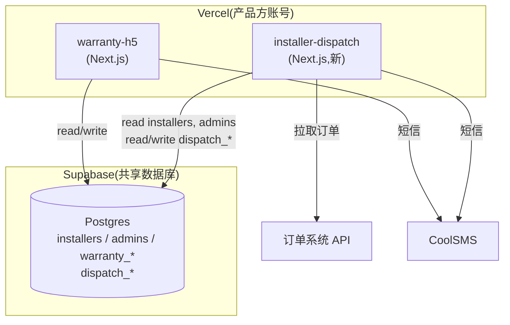
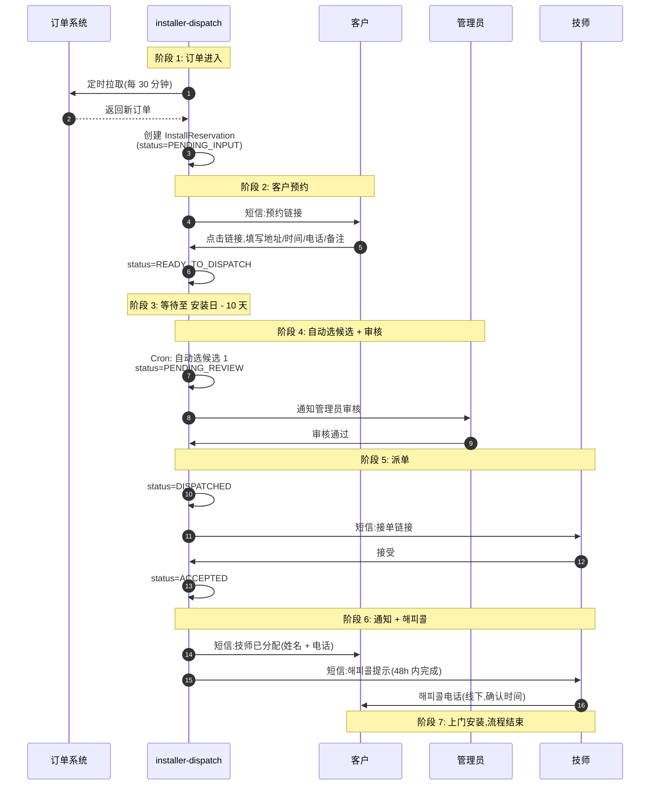

# PRD: 설치 기사 자동 배정 시스템 (v1.2)

> **项目代号:** Installer Auto-Assignment
> **新建仓库名:** `installer-dispatch`
> **关联项目:** warranty-h5(共享数据库与 admin 账号)
> **文档版本:** v1.2
> **最后更新:** 2026-05-06
> **文档目的:** 本文档作为外包开发的需求规格说明,供外包工程师按此实现。任何超出本文档范围的功能,需先与产品方确认后再开发。
> **v1.1 → v1.2 主要变化:**
> - 第 5.1 章 `installers` 表扩展字段名跟现有 schema 对齐(保留 `branch` / `address` / `category` 不动)
> - 新增 `has_aqara_hub_inventory` 字段(弱参考项,仅展示)
> - 第 6.3 章地区匹配算法加 fallback 说明:`service_areas` 为空时退化到 region only
> - 第 9 章管理后台:候选列表里展示弱参考标识(✅/❌ 是否有 Aqara 허브 库存)
> - 第 13 章 M0 加上"产品方完成数据清洗 + survey 页面适配"作为前置条件

---

## 1. 背景与目标

### 1.1 背景

Aqara 韩国市场销售的部分产品(스마트 도어락、도어벨、월패드 연동기 等)需要专业技师上门安装。目前的技师分配依赖管理员人工操作,存在三个问题:

1. 管理员需要逐单查看技师能力和地区,匹配效率低
2. 技师人选缺乏标准化规则,质量不稳定
3. 客户安装地址和配送地址常不一致,人工核对易出错

本项目通过引入「自动分配候选 + 管理员审核」的半自动派单流程来解决上述问题。

### 1.2 目标

- 客户下单后通过短信自助提交安装预约信息(地址、时间、联系电话)
- 系统在安装日前 10 天根据**技师能力 + 地区匹配**规则自动选出候选技师
- 管理员审核确认后,自动通过短信派单给技师
- 支持技师拒单后的备选派单流程
- 提供管理后台,覆盖派单看板、手动干预、拒单记录、异常报警

### 1.3 非目标(本期不做)

- ❌ 커튼 类产品的派单(技师档案目前不支持커튼能力字段)
- ❌ 跨订单合并(把多个邻近订单分给同一技师)
- ❌ 基于地图 API 的精确距离计算和成本核算
- ❌ 基于技师评分/星级的优先排序
- ❌ 客户端订单进度追踪页
- ❌ 技师端 App / Web 工作台(本期通过短信 + 短链页面交互)
- ❌ 派单时段感知(同日多单冲突由技师与客户自行协调)
- ❌ warranty-h5 首页入口卡片(由产品方在派单系统上线后自行添加)
- ❌ Aqara 허브 库存影响算法排序(本期作弱参考仅展示)

---

## 2. 范围与约束

### 2.1 技术约束

- **独立项目**: 在新的 GitHub 仓库 `installer-dispatch` 中开发,与 warranty-h5 物理隔离
- **技术栈固定**(必须与 warranty-h5 一致):
  - Next.js 16 App Router
  - React 19
  - Prisma 7
  - Supabase Postgres
  - Tailwind CSS 4
  - TypeScript 严格模式
- **数据库**: 共用 warranty-h5 的 Supabase Postgres 项目(连接串由产品方提供)
- **Schema 管理**:
  - `prisma/schema.prisma` 文件由**产品方提供**,外包**不在本项目维护**
  - 所有 schema 变更(新增表、修改字段)在 warranty-h5 仓库中由产品方完成 migration
  - 外包在本项目运行 `npx prisma generate` 生成 TypeScript 类型即可
  - 外包**不允许**对 `installers` / `admins` 等已有表做任何 schema 修改
- **短信通道**: CoolSMS,凭证由产品方提供;开发期间使用 mock 实现
- **管理员账号**: 复用 warranty-h5 的 `admins` 表;外包项目自实现 session 机制(签发 cookie / 校验 login_code),**不调用 warranty-h5 的任何 API**
- **部署**: Vercel,产品方账号下;外包仅通过 PR 提交代码,不接触部署密钥
- **代码规范**: ESLint Airbnb,注释中英双语
- **域名 / 入口**:
  - 派单系统的域名由产品方后续配置
  - warranty-h5 首页入口卡片由产品方后续添加,**不在本项目交付范围内**

### 2.2 与现有系统的关系

- **新流程独立**: 与现有 warranty-h5 中的 `/reg`(门锁安装登记)+ `/confirm`(门锁安装完成确认)流程**并存**,不替换
- **共享数据库**: 通过同一个 Supabase Postgres 协作;新表统一加 `dispatch_` 前缀
- **不互调 API**: 两个项目运行时不通过 HTTP 通信,只共享数据库
- **现有 `installers` 表只扩展不破坏**: 见 5.1

### 2.3 部署架构



---

## 3. 角色

| 角色 | 描述 |
|---|---|
| **客户(Customer)** | 在外部商城下单的最终用户。通过短信链接提交安装预约。 |
| **技师(Installer)** | 上门安装的技师。通过短信链接接受/拒绝派单。 |
| **管理员(Admin)** | warranty-h5 后台管理员(账号复用)。审核派单、处理异常。 |
| **系统(System)** | 自动定时拉取订单、自动分配候选、自动发送短信。 |

---

## 4. 端到端流程

### 4.1 主流程时序图



### 4.2 状态流转

`InstallReservation` 是核心实体,状态转换如下:

```
PENDING_INPUT          客户尚未填写预约信息
    ↓ (客户填写) / (72h 未填 + 24h 后催收) / (96h 仍未填 → 用配送地址兜底)
READY_TO_DISPATCH      预约信息已确定,等待派单时间窗(安装日-10 天)
    ↓ (Cron 触发,系统选候选 1)
PENDING_REVIEW         系统已选候选,等待管理员审核
    ↓ (管理员审核通过)
DISPATCHED             已派单给技师,等待技师回复
    ↓ (技师接受) / (48h 未回 / 拒绝 → 回到 PENDING_REVIEW,选候选 2)
ACCEPTED               技师已接受
    ↓ (上门完成,管理员手动标记或外部触发)
COMPLETED              安装完成

异常分支:
* CANCELLED            订单取消(任何阶段管理员可手动取消)
* MANUAL_REQUIRED      候选 2 也拒绝 / T-3 仍未派出 → 等待管理员手动处理
```

### 4.3 关键时间节点

| 节点 | 事件 |
|---|---|
| T-30 ~ T-1 | 客户可选的安装日范围(最多 1 个月之后) |
| T₀ | 订单进入系统,发送预约链接,链接 72h 内有效 |
| T₀ + 72h | 链接过期,发催收短信(再发一次,有效期再 24h) |
| T₀ + 96h | 仍未填,系统用订单配送地址兜底,生成预约信息 |
| 安装日 - 10 天 | 自动派单触发(选候选 1,提交管理员审核) |
| 派单后 + 48h | 技师未回复视为拒绝,自动选候选 2 |
| 安装日 - 3 天 | 兜底报警:仍未成功派单则触发管理员告警 |
| 接单后 + 48h | 技师必须完成해피콜 |

---

## 5. 数据模型

> ⚠️ 本章定义的所有表/字段的最终 schema 由产品方在 warranty-h5 仓库的 `prisma/schema.prisma` 文件中维护并提供给外包。
> 外包**不在 installer-dispatch 仓库内修改 schema**,仅运行 `npx prisma generate` 同步类型。

### 5.1 现有表 `installers` 扩展(由产品方完成)

现有字段保留不变(`id` / `name` / `phone` / `branch` / `region` / `coverage` / `address` / `category` / `ability` / `install_count` / `happy_call_lt` / `defect_count` / `dissatisfaction_note` / `created_at` / `updated_at`)。

新增以下字段:

| 字段 | 类型 | 默认值 | 说明 |
|---|---|---|---|
| `service_areas` | `text[]` | `[]` | 출장 가능 시/구列表,标准格式见附录 A;为空时算法 fallback 到 region 级别匹配 |
| `capabilities` | `text[]` | `[]` | 设치 가능 항목,可选: `DOORLOCK` / `DOORBELL` / `WALLPAD_HUB` / `OTHER` |
| `aqara_app_capability` | `text` (CHECK 约束) | `'NONE'` | 三选一: `NONE` / `DOORLOCK_AND_APP` / `DOORLOCK_AND_APP_AND_HUB` |
| `has_aqara_hub_inventory` | `boolean` | `false` | 是否持有 Aqara 도어락용 연동기 库存(**弱参考项,仅展示**) |
| `monthly_dispatch_count` | `integer` | `0` | 当月已被分配的工单数;每月 1 号置 0 |
| `active` | `boolean` | `true` | 是否当前可接单 |

新增索引:

```sql
CREATE INDEX installers_active_idx ON installers (active);
CREATE INDEX installers_capabilities_gin_idx ON installers USING gin (capabilities);
CREATE INDEX installers_service_areas_gin_idx ON installers USING gin (service_areas);
```

> 📝 **旧字段 `coverage` / `ability` 保留**,作为历史档案与迁移期人工核对参考;待新字段稳定运行后,由产品方单独处理废弃。
> 📝 **数据迁移由产品方完成**:见 13 章 M0,产品方需在外包启动 M2(派单算法)前完成现有 ~N 名技师的字段清洗。
> 📝 **survey 页面**(`https://www.aqaralife-service.kr/survey`)由产品方同步改造,新技师录入时直接写新字段。

### 5.2 新增表(统一加 `dispatch_` 前缀)

#### `dispatch_reservations`(安装预约主表)

| 字段 | 类型 | 说明 |
|---|---|---|
| `id` | uuid PK | |
| `external_order_id` | string UNIQUE | 来自订单 API 的订单号,用于去重 |
| `status` | enum | 见 4.2 状态机 |
| `customer_name` | string | 客户姓名(默认从订单 API 带,客户可改) |
| `customer_phone` | string | 客户电话(默认从订单 API 带,客户可改) |
| `delivery_address` | jsonb | 订单原始配送地址(只读,作为兜底) |
| `install_address_zip` | string? | 安装地址-우편번호 |
| `install_address_basic` | string? | 安装地址-기본 주소 |
| `install_address_detail` | string? | 안装地址-상세 주소 |
| `install_address_region` | string? | 标准化后的 광역(系统从安装地址解析) |
| `install_address_district` | string? | 标准化后的 시/구(系统从安装地址解析) |
| `install_date` | date? | 客户选定的安装日期 |
| `customer_note` | string? | 客户备注(选填) |
| `products` | jsonb | 来自订单 API 的产品列表(SKU、名称、数量、type) |
| `required_capabilities` | text[] | 系统从产品列表推断出的必需能力 |
| `requires_aqara_app` | text? | 系统从产品列表推断的 Aqara App 能力要求 |
| `reservation_token` | string UNIQUE | 客户预约链接 token |
| `reservation_token_expires_at` | timestamp | 客户预约链接到期时间 |
| `customer_reminder_sent_at` | timestamp? | 催收短信发送时间 |
| `fallback_used` | boolean | 是否走了"用配送地址兜底"分支 |
| `current_dispatch_id` | uuid? | 当前生效的派单记录 |
| `created_at` / `updated_at` | timestamp | |

#### `dispatch_attempts`(派单记录)

每生成一次"候选 → 派单"就插一条。

| 字段 | 类型 | 说明 |
|---|---|---|
| `id` | uuid PK | |
| `reservation_id` | uuid FK | 关联 `dispatch_reservations` |
| `installer_id` | text FK | 关联 `installers.id`(注意 installers.id 是 text) |
| `attempt_no` | int | 第几轮派单 |
| `source` | enum | `AUTO` / `MANUAL` |
| `match_tier` | enum | `EXACT_DISTRICT` / `REGION_ONLY` / `MANUAL_OVERRIDE` |
| `status` | enum | `PENDING_REVIEW` / `SENT` / `ACCEPTED` / `REJECTED` / `TIMEOUT` / `CANCELLED_BY_ADMIN` |
| `dispatch_token` | string UNIQUE | 技师接单链接 token |
| `dispatch_token_expires_at` | timestamp | 派单时间 + 48h |
| `reviewed_by_admin_id` | uuid FK? | 审核管理员 |
| `reviewed_at` | timestamp? | |
| `sent_at` | timestamp? | 短信发送时间 |
| `responded_at` | timestamp? | 技师响应时间 |
| `rejection_reason` | string? | 拒绝理由(选填) |
| `created_at` / `updated_at` | timestamp | |

#### `dispatch_alerts`(异常告警)

| 字段 | 类型 | 说明 |
|---|---|---|
| `id` | uuid PK | |
| `reservation_id` | uuid FK | |
| `type` | enum | `T_MINUS_3_NOT_DISPATCHED` / `BOTH_CANDIDATES_REJECTED` / `NO_CANDIDATE_FOUND` / `ORDER_API_FAILED` |
| `severity` | enum | `WARN` / `CRITICAL` |
| `payload` | jsonb | 详细信息 |
| `resolved` | boolean | 管理员是否已处理 |
| `resolved_by` | uuid FK? | |
| `resolved_at` | timestamp? | |
| `created_at` | timestamp | |

#### `dispatch_message_logs`(短信发送记录)

| 字段 | 类型 | 说明 |
|---|---|---|
| `id` | uuid PK | |
| `reservation_id` | uuid FK? | |
| `dispatch_id` | uuid FK? | |
| `template_id` | text | 模板 ID(见第 10 章) |
| `to_phone` | text | 接收方电话 |
| `body` | text | 渲染后的内容 |
| `provider` | text | 'coolsms' |
| `provider_message_id` | text? | CoolSMS 返回的 ID |
| `status` | enum | `PENDING` / `SENT` / `FAILED` |
| `error` | text? | |
| `created_at` | timestamp | |

---

## 6. 核心算法:候选技师选择

### 6.1 输入

- `dispatch_reservations`: 必需能力、Aqara 能力要求、安装地址(标准化后的 광역 + 시/구)
- `installers` 表中 `active=true` 的技师

### 6.2 筛选规则(硬约束,不满足则淘汰)

1. **能力包含**: 技师的 `capabilities` 必须**包含**预约 `required_capabilities` 中的全部值
2. **Aqara 能力满足**: 如果预约 `requires_aqara_app` 不为 `NONE`,技师的 `aqara_app_capability` 必须 **≥** 要求等级
   - 等级排序: `NONE < DOORLOCK_AND_APP < DOORLOCK_AND_APP_AND_HUB`
3. **地区可达**: 必须满足 6.3 的「地区匹配」中至少 Tier 2

> ⚠️ **`has_aqara_hub_inventory` 不参与硬约束筛选**,不参与排序。仅作为弱参考项展示给管理员(见 9.2)。

### 6.3 地区匹配(Tier 系统)

| Tier | 条件 |
|---|---|
| **Tier 1: EXACT_DISTRICT** | 用户的 `district` ∈ 技师 `service_areas`,且按附录 A 标准格式比较 |
| **Tier 2: REGION_ONLY** | 用户 `district` 不在 `service_areas`(或技师 `service_areas` 为空),但用户 `region` == 技师 `region` |
| **不匹配** | 上述两条都不满足 → 淘汰 |

> 📝 **数据清洗未完成时的兼容**:在产品方完成数据清洗前(见 M0),老技师的 `service_areas` 可能为空数组。此时所有匹配自动 fallback 到 Tier 2(REGION_ONLY),管理员审核环节做兜底。这是预期行为,不是 bug。

### 6.4 排序规则(同档内多个候选时)

第一档(EXACT_DISTRICT)内的技师优先于第二档(REGION_ONLY)。同档内排序:

1. **`monthly_dispatch_count` 升序**(本月接单少的优先,粗粒度均衡)
2. tie-break: `installers.id` 升序(稳定排序)

### 6.5 输出

候选列表(已排序)。系统取**前 1 名**作为候选 1 进入审核;若候选 1 拒绝,取**第 2 名**作为候选 2。**候选 2 拒绝则不再自动派**,转入 `MANUAL_REQUIRED`。

### 6.6 边界情况

| 情况 | 处理 |
|---|---|
| 候选名单为空 | 创建 `NO_CANDIDATE_FOUND` 告警(CRITICAL),状态置为 `MANUAL_REQUIRED` |
| 候选名单只有 1 人,候选 1 拒绝 | 直接 `MANUAL_REQUIRED` |
| 候选 1 审核被管理员驳回 | 该 dispatch 标记 `CANCELLED_BY_ADMIN`,管理员手动指定的派单走 `source=MANUAL` |

---

## 7. 推断规则:从产品到「必需能力」

订单 API 返回的 `products` 列表里每个产品需要包含 `type` 字段。系统据此推断:

| 产品 type | 必需能力 | Aqara App 要求 |
|---|---|---|
| `DOORLOCK_BASIC` | `[DOORLOCK]` | `DOORLOCK_AND_APP` |
| `DOORLOCK_HUB` | `[DOORLOCK]` | `DOORLOCK_AND_APP_AND_HUB` |
| `DOORBELL` | `[DOORBELL]` | `NONE` |
| `WALLPAD_HUB` | `[WALLPAD_HUB]` | `NONE` |
| `OTHER` | `[OTHER]` | `NONE` |

> 📝 该映射表外包工程师在 `src/lib/product-capability-map.ts` 中以可配置方式实现。
> ⚠️ TODO(business): 待业务方提供完整的 SKU/型号 → type 映射表。

订单内多产品时:必需能力取**并集**,Aqara App 要求取**最高等级**。

---

## 8. API 接口清单

### 8.1 客户端(无需鉴权,token 验证)

- `GET /api/reservation/[token]` — 客户访问预约链接时获取信息
- `POST /api/reservation/[token]` — 客户提交预约信息

### 8.2 技师端(无需鉴权,token 验证)

- `GET /api/dispatch/[token]` — 技师查看派单详情(电话脱敏)
- `POST /api/dispatch/[token]/accept` — 接受
- `POST /api/dispatch/[token]/reject` — 拒绝(可选填理由)

### 8.3 管理后台(需 admin session)

> ⚠️ admin 鉴权由本项目自实现:校验 `admins` 表中的 `login_code`,签发自己的 session cookie。**不调用 warranty-h5 的任何接口**。

- `POST /api/admin/login` / `POST /api/admin/logout`
- `GET /api/admin/reservations` — 派单看板列表
- `GET /api/admin/reservations/[id]` — 详情(含所有 dispatch_attempts)
- `POST /api/admin/reservations/[id]/approve-dispatch`
- `POST /api/admin/reservations/[id]/reject-dispatch`
- `POST /api/admin/reservations/[id]/manual-dispatch` — 手动派单
- `GET /api/admin/reservations/[id]/candidates` — 完整候选列表(包含每人的 `match_tier`、`monthly_dispatch_count`、**`has_aqara_hub_inventory`**)
- `POST /api/admin/reservations/[id]/cancel`
- `GET /api/admin/alerts`
- `POST /api/admin/alerts/[id]/resolve`

### 8.4 内部定时任务(Vercel Cron)

| 任务 | 频率 | 行为 |
|---|---|---|
| `cron:fetch-orders` | 每 30 分钟 | 拉取订单 API,创建预约,发预约短信 |
| `cron:remind-customers` | 每小时 | 查 PENDING_INPUT 且 token 过期的预约,发催收 |
| `cron:fallback-reservations` | 每小时 | 96h 仍未填,用配送地址兜底,推进到 READY_TO_DISPATCH |
| `cron:auto-dispatch` | 每天凌晨 03:00 | 查 install_date == today + 10 的预约,选候选 1 |
| `cron:dispatch-timeout` | 每小时 | dispatch_token 过期且 status=SENT 的派单,标记 TIMEOUT,触发候选 2 |
| `cron:t-minus-3-alert` | 每天上午 10:00 | install_date <= today + 3 且未 ACCEPTED → CRITICAL 告警 |
| `cron:reset-monthly-counter` | 每月 1 号 00:00 | 重置 `monthly_dispatch_count` |

---

## 9. 管理后台需求

新建管理后台模块 `/admin/dispatch`,包含以下页面:

### 9.1 派单看板(`/admin/dispatch`)

- 默认按 install_date 升序展示所有未 COMPLETED 预约
- 顶部分组 tab: 待审核 / 待回复 / 已派单 / 异常 / 全部
- 每行展示: 订单号、客户姓名、安装日期(距今 X 天)、地址(시/구)、产品摘要、当前 status、当前候选技师姓名
- 行内快捷操作: 查看详情 / 通过审核 / 驳回审核 / 手动派单 / 取消

### 9.2 预约详情(`/admin/dispatch/[id]`)

- 上半部分: 预约信息(只读)
- 中间: 推断的必需能力 + Aqara 要求(只读)
- 下半部分: 派单历史(每条 dispatch_attempt 的时间线)+ 当前候选列表(供手动派单)
- 操作按钮: 通过当前审核 / 驳回 / 手动选别人 / 取消整单

**候选列表展示要求**:
- 姓名 / 电话 / region / service_areas / 本月接单数
- `match_tier` 标签(EXACT_DISTRICT 显示绿色,REGION_ONLY 显示黄色)
- **`has_aqara_hub_inventory`**: 若 true 显示 ✅ "허브 보유",false 显示 ❌(纯展示,辅助管理员判断)
- 排序按算法默认顺序

### 9.3 异常告警(`/admin/dispatch/alerts`)

- 列出未处理告警,按严重程度排序
- CRITICAL 告警在主导航上以红点提示

> 📝 技师档案管理(`기사관리` 页面)由产品方在 warranty-h5 项目中扩展,不在 installer-dispatch 项目内实现。
> 外包项目中只读取 `installers` 表使用,不提供编辑界面。

---

## 10. 短信文案清单

> 📝 短信通过 **CoolSMS** 发送,凭证由产品方提供。所有外发短信需在 `dispatch_message_logs` 表保留发送记录。
> ⚠️ 所有韩文文案为**初稿**,需业务方/法务最终确认。

### 10.1 客户预约链接 (`tpl:customer_reserve`)

```
[Aqara] {customer_name}님, 주문해주신 상품의 설치 예약을 진행해주세요.
일정 및 주소 입력: {link}
(72시간 내 미입력 시 배송지 기준으로 자동 진행됩니다)
```

### 10.2 客户催收短信 (`tpl:customer_remind`)

```
[Aqara] {customer_name}님, 설치 예약이 아직 완료되지 않았습니다.
24시간 내 미입력 시 배송지 기준으로 자동 배정됩니다.
{link}
```

### 10.3 技师派单短信 (`tpl:installer_dispatch`)

```
[Aqara] 신규 설치 배정 요청입니다.
설치일: {install_date}
지역: {region} {district}
제품: {product_summary}
상세 확인 및 수락/거절: {link}
(48시간 내 미응답 시 자동 거절 처리)
```

### 10.4 客户:技师已分配通知 (`tpl:customer_assigned`)

```
[Aqara] {customer_name}님, 설치 기사 배정이 완료되었습니다.
담당 기사: {installer_name} ({installer_phone})
설치일: {install_date}
기사가 곧 해피콜로 연락드릴 예정입니다.
```

### 10.5 技师:해피콜提示 (`tpl:installer_happycall`)

```
[Aqara] 배정 수락이 완료되었습니다.
48시간 내 고객님께 해피콜을 진행해 주세요.
고객: {customer_name} ({customer_phone})
주소: {full_address}
```

---

## 11. 异常处理

| 场景 | 处理方式 |
|---|---|
| 订单 API 拉取失败 | 记录失败日志、重试 3 次(指数退避)、连续失败发告警 |
| 客户预约 token 过期 | 页面友好提示,引导联系客服 |
| 客户提交的安装日期不在 [今天+1, 今天+30] | 前端 + 后端双校验 |
| 客户提交的地址解析失败(无法提取 region/district) | 后端提示客户重填 |
| 候选名单为空 | `NO_CANDIDATE_FOUND` 告警 |
| 候选 1 拒绝且无候选 2 | `MANUAL_REQUIRED` |
| 技师 token 过期 | 页面友好提示;系统已自动转候选 2 |
| 派单审核被驳回但无可用其他候选 | `MANUAL_REQUIRED` |
| T-3 仍未派出 | CRITICAL 告警 |
| CoolSMS 发送失败 | 记录失败、重试 1 次、仍失败则告警 |
| 同一订单被重复拉取 | 用 `external_order_id` UNIQUE 约束去重 |

---

## 12. 非功能性需求

### 12.1 性能

- 派单匹配算法在 ≤200 名技师规模下,单次匹配 < 200ms
- 派单看板首屏(≤50 条)< 1s

### 12.2 可观测性

- 所有 Cron 执行结果写日志(执行时间、处理条数、失败数)
- 每条短信发送写 `dispatch_message_logs`
- 所有状态变更写审计日志

### 12.3 安全

- 客户预约 token、技师 dispatch token 长度 ≥ 32 字符,使用 `crypto.randomUUID()` 或同等强度生成
- 客户电话、技师电话不出现在 URL 参数中
- 技师在接受派单前**不可看到**客户全名(脱敏:홍**)和电话
- 管理后台所有写操作需 admin level 1 权限
- 所有外部入参严格校验(SQL 注入、IDOR)

### 12.4 时区

- 后端 UTC 存储,前端展示用 `Asia/Seoul`(KST)
- "T-10"等计算基于 KST 日历日

---

## 13. 里程碑与交付物

### M0(产品方前置工作,与 M1 并行,但必须在 M2 启动前完成)

由产品方完成,**不在外包交付范围**:

- ✅ 跑 `migration-installers-extension.sql`,扩展 `installers` 表
- ✅ 完成现有技师数据清洗(参见模板 `installers-data-cleanup-template.xlsx`)
- ✅ 改造 `https://www.aqaralife-service.kr/survey` 页面以匹配新字段
- ✅ 给外包提供 `prisma/schema.prisma` 文件、Supabase 开发库连接串、CoolSMS 凭证、订单 API 凭证、假数据 seed 脚本

### M1: 项目脚手架 + 数据模型 + 订单同步 + 客户预约(预计 1 周)

- 创建 `installer-dispatch` 仓库,搭建 Next.js + Prisma 脚手架
- 接收产品方提供的 schema 文件,运行 prisma generate
- 订单 API 拉取定时任务(开发阶段使用 mock 数据)
- 客户预约页面 + token 校验
- 兜底/催收逻辑
- CoolSMS 集成(开发阶段使用 mock)
- 单元测试覆盖核心校验

### M2: 派单算法 + 技师交互(预计 1 周)

- 候选选择算法实现 + 单测(覆盖 6.6 所有边界 + service_areas 为空时的 fallback)
- 自动派单 Cron
- 技师接受/拒绝页面 + token 校验
- 候选 2 流程
- 完整短信文案对接

### M3: 管理后台(预计 1 周)

- admin session 实现(读 `admins` 表,自签 cookie)
- 派单看板
- 预约详情页(含审核 + 候选列表 + 弱参考标识展示)
- 手动派单
- 告警列表

### M4: 异常处理 + 联调 + 上线(预计 0.5 周)

- 所有 Cron 异常重试
- T-3 告警
- 端到端测试用例
- 文档(README、运维手册)
- 配合产品方完成生产环境部署

**外包工程师需在每个 M 完成时提交 PR、单测覆盖率 ≥ 70%、并写 RUNBOOK 文档。**

---

## 14. 验收标准

### 14.1 主流程验收

- ✅ 订单 API 推一个新订单,30 分钟内客户收到预约短信
- ✅ 客户填写预约后,72h 内重复点击链接显示"已提交"
- ✅ 客户不填写,96h 后系统用配送地址自动推进
- ✅ 安装日 == 今天 + 10,凌晨 Cron 自动选候选并产生 PENDING_REVIEW
- ✅ 管理员审核通过 → 技师收到派单短信
- ✅ 技师 48h 内点接受 → 客户收到通知短信、技师收到해피콜提示
- ✅ 技师 48h 内点拒绝 → 系统自动选候选 2 进入审核
- ✅ 候选 1 + 候选 2 都拒 → 状态变 MANUAL_REQUIRED + 告警

### 14.2 算法验收

- ✅ 仅有 도어락 能力的技师不会被分到 도어벨 订单
- ✅ Aqara 能力不够的技师不会被分到 DOORLOCK_HUB 订单
- ✅ 同档内,本月接单数少的技师优先
- ✅ EXACT_DISTRICT 技师永远优先于 REGION_ONLY 技师
- ✅ `service_areas` 为空的老技师能被 fallback 匹配到(同 region 时)
- ✅ `has_aqara_hub_inventory` 不影响匹配结果,只影响候选列表的展示

### 14.3 异常验收

- ✅ 订单 API 三次失败后产生告警
- ✅ T-3 仍未 ACCEPTED 产生 CRITICAL 告警
- ✅ 候选名单为空时产生 NO_CANDIDATE_FOUND 告警

### 14.4 鉴权验收

- ✅ 用 `admins` 表中存在的 login_code 可登录管理后台
- ✅ 管理后台 API 在未登录时全部返回 401
- ✅ 客户/技师 token 无效或过期时,API 返回明确错误

---

## 15. 待确认事项 (TODO)

1. **TODO(business)**: 完整的 SKU/型号 → 产品 type 映射表
2. **TODO(business)**: 订单 API 的访问凭证、endpoint、字段示例
3. **TODO(business)**: 短信文案的最终韩文版本(法务/品牌方确认)
4. **TODO(business)**: 客户填写电话能否覆盖订单收件人电话(本 PRD 默认是"可改")
5. **TODO(business)**: 是否限制技师本月接单数上限(本 PRD 默认无上限)
6. **TODO(business)**: 行政区标准化字典是否需要外包工程师做严格校验/解析,或允许自由文本(本 PRD 假设按附录 A 格式)
7. **TODO(legal)**: 客户预约页面是否需要单独的 개인정보 수집 동의 文案
8. **TODO(产品方提供)**: `prisma/schema.prisma` 文件
9. **TODO(产品方提供)**: CoolSMS API 凭证、sender 号码、SDK 调用文档
10. **TODO(产品方提供)**: 独立 Supabase 开发项目的连接串
11. **TODO(产品方提供)**: 假数据 seed 脚本
12. **TODO(产品方提供)**: 派单系统的最终域名/部署配置

---

## 16. 开发环境与权限

### 16.1 产品方提供给外包

| 项 | 说明 |
|---|---|
| GitHub 仓库 | `installer-dispatch`,Write 权限 collaborator |
| `prisma/schema.prisma` | 完整 schema 文件 |
| Supabase 开发项目连接串 | `DATABASE_URL` 和 `DIRECT_URL` |
| 假数据 seed 脚本 | 含若干假技师、假订单、假管理员 |
| `.env.example` | 模板,密码用占位符 |
| CoolSMS 开发凭证 | sender 号码可能受限 |
| 订单 API 开发环境凭证 | sandbox / mock |
| PRD 文档 | 本文档 |
| NDA(개인정보 보호 약정서) | 韩文版,签字后开始 |

### 16.2 产品方**不**提供给外包

- ❌ Supabase 主账号
- ❌ 生产数据库连接串
- ❌ CoolSMS 生产凭证
- ❌ 订单 API 生产凭证
- ❌ Vercel 部署权限
- ❌ 任何真实用户/技师/订单数据
- ❌ warranty-h5 仓库的 Admin 权限(可给 Read 权限参考代码风格)

### 16.3 上线流程

1. 外包在自己的分支开发
2. 提交 PR 到 `main`
3. 产品方 review 代码 → merge
4. 产品方在 Vercel 上部署
5. 外包不直接接触生产环境

### 16.4 schema 同步流程

1. 外包发现需要新增/修改表 → 在 PR 描述中说明,**不**自行修改 schema
2. 产品方在 warranty-h5 仓库的 `prisma/schema.prisma` 中修改并跑 migration
3. 产品方将更新后的 schema 文件发给外包
4. 外包替换 schema,跑 `npx prisma generate` 同步类型

---

## 附录 A: 行政区标准化规则

为保证派单匹配准确,所有地区字符串统一为以下格式:

| 类型 | 简称(用于 region) | service_areas 元素格式 |
|---|---|---|
| 광역시/특별시 | `서울` / `부산` / `인천` / `대구` / `대전` / `광주` / `울산` / `세종` | `"광역简称 구"`,例: `"서울 강남구"` |
| 도 | `경기` / `강원` / `충북` / `충남` / `전북` / `전남` / `경북` / `경남` / `제주` | `"광역简称 시"` 或 `"광역简称 시 구"`,例: `"경기 부천시"` / `"경기 수원시 영통구"` |

**规则要点(混合粒度)**:
- 광역시 内统一到구级别(서울 25 个구、부산 16 个구 등)
- 도 内统一到시级别;특정 시(수원/창원/고양 等)细到구

**字段对应**:
- `installers.region` = 光역简称
- `installers.service_areas` = 标准格式数组
- `dispatch_reservations.install_address_region` = 광역简称
- `dispatch_reservations.install_address_district` = 用于匹配 `service_areas` 元素的"구" 或 "시" 部分

**Tier 1 (EXACT_DISTRICT) 匹配示例**:

```
用户地址: 서울특별시 강남구 테헤란로 123
解析: install_address_region='서울', install_address_district='강남구'
比较: 用户的 "서울 강남구" ∈ 技师的 service_areas?
```

```
用户地址: 경기도 부천시 원미구 ...
解析: install_address_region='경기', install_address_district='부천시 원미구'
比较: 先尝试精确匹配 "경기 부천시 원미구";若未命中,尝试父级 "경기 부천시"
```

---

## 附录 B: 订单 API 假定字段(待业务方确认)

```json
{
  "order_id": "ORD20260505001",
  "ordered_at": "2026-05-05T10:23:00+09:00",
  "customer": {
    "name": "홍길동",
    "phone": "010-1234-5678"
  },
  "delivery_address": {
    "zip": "06236",
    "basic": "서울특별시 강남구 테헤란로 123",
    "detail": "456동 789호"
  },
  "products": [
    {
      "sku": "AQARA-LOCK-U200",
      "name": "Aqara 스마트 도어락 U200",
      "quantity": 1,
      "type": "DOORLOCK_BASIC"
    }
  ],
  "status": "PAID"
}
```

字段命名以业务方实际提供的为准。

---

**文档结束。**

如对本 PRD 有任何疑问,先标记为 `TODO(business)` 或 `TODO(tech)` 在代码注释或 PR 描述中,**不要自行假设业务规则**。
