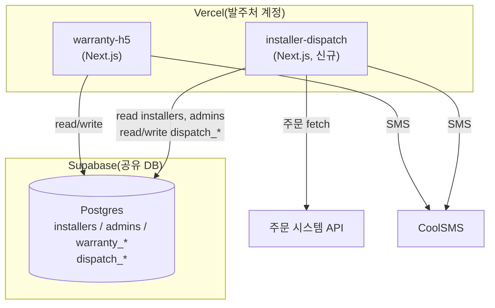
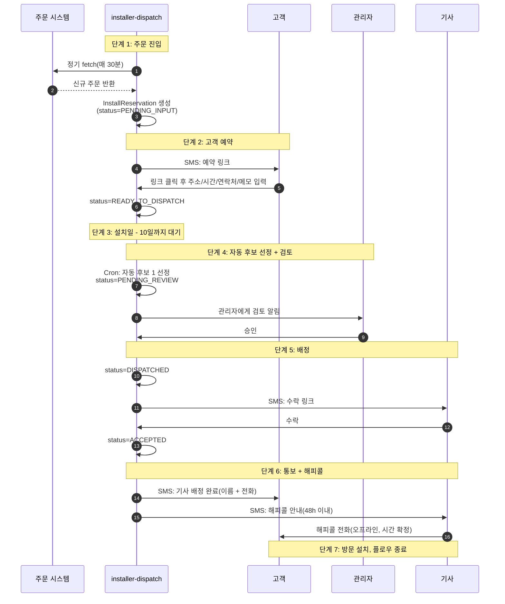

# PRD: 설치 기사 자동 배정 시스템 (v1.3)

> **프로젝트 코드:** Installer Auto-Assignment
> **신규 저장소명:** `installer-dispatch`
> **연관 프로젝트:** warranty-h5(데이터베이스 및 admin 계정 공유)
> **문서 버전:** v1.3
> **최종 수정일:** 2026-05-06
> **문서 목적:** 본 문서는 외주 개발의 요구사항 명세서이며, 외주 엔지니어는 본 문서에 따라 구현합니다. 본 문서 범위를 벗어나는 기능은 발주처와 사전 합의 후 개발해야 합니다.
>
> **v1.2 → v1.3 주요 변경사항:**
> - 고객 선택 가능한 설치일 범위를 `T-30 ~ T-2`로 조정(배송 시간 고려; §4.3 / §11)
> - "단기 윈도우 즉시 배정" 분기 신설: READY_TO_DISPATCH 시점에 설치일이 today + 10 이내라면 cron을 기다리지 않고 곧바로 PENDING_REVIEW로 전환(§4.2 / §8.4 / §14.1)
> - Tier 1 매칭 알고리즘을 `"{region} {district}"` ∈ `service_areas` 의 문자열 결합 비교로 명시(§6.3 / 부록 A 의사코드 추가)
> - `dispatch_reservations.requires_aqara_app` 를 CHECK 제약이 있는 enum 으로 변경, `installers.aqara_app_capability` 와 동일(§5.2)
> - `installers.id` / `admins.id` 를 참조하는 모든 FK 를 `text` 로 통일(§5.2, Prisma `String @id` 의 실제 PG 컬럼 타입과 일치)
> - §4.2 에 취소의 사이드 이펙트 규칙 보충(ACCEPTED 이후 취소는 관리자가 양측에 수동 통보)
> - §8.4 / §12.4 에 cron schedule 은 UTC 이며, 모든 handler 내 날짜 계산은 KST 변환 필수임을 명시
>
> **v1.1 → v1.2 주요 변경사항:**
> - 5.1 장: `installers` 테이블 확장 필드명을 기존 schema 와 정렬(`branch` / `address` / `category` 보존)
> - `has_aqara_hub_inventory` 필드 신설(약한 참고 항목, 표시용)
> - 6.3 장 지역 매칭 알고리즘에 fallback 설명 추가: `service_areas` 가 비어있을 경우 region only 로 폴백
> - 9 장 관리자 화면: 후보 목록에 약한 참고 표시(✅/❌ Aqara 허브 재고 보유 여부)
> - 13 장 M0 에 "발주처가 데이터 클렌징 + survey 페이지 적용 완료" 를 전제 조건으로 추가

---

## 1. 배경 및 목표

### 1.1 배경

Aqara 한국 시장에서 판매되는 일부 제품(스마트 도어락, 도어벨, 월패드 연동기 등)은 전문 기사가 직접 방문하여 설치합니다. 현재 기사 배정은 관리자 수작업에 의존하며, 다음 세 가지 문제가 있습니다:

1. 관리자가 건별로 기사 능력과 지역을 확인해야 하므로 매칭 효율이 낮음
2. 기사 선정 기준이 표준화되어 있지 않아 품질이 불안정함
3. 고객 설치 주소와 배송 주소가 일치하지 않는 경우가 많아 수기 확인 시 오류가 발생하기 쉬움

본 프로젝트는 「자동 후보 선정 + 관리자 검토」의 반자동 배정 플로우를 도입하여 위 문제를 해결합니다.

### 1.2 목표

- 고객이 주문 후 SMS 를 통해 셀프로 설치 예약 정보(주소, 시간, 연락처) 제출
- 시스템이 설치일 10일 전에 **기사 능력 + 지역 매칭** 규칙으로 후보 기사 자동 선정
- 관리자 검토 승인 후, SMS 로 기사에게 자동 배정
- 기사 거절 시 차순위 후보 배정 플로우 지원
- 관리자 백오피스 제공: 배정 보드, 수동 개입, 거절 이력, 예외 알림 포함

### 1.3 비목표(본 단계 제외)

- ❌ 커튼류 제품 배정(기사 프로필이 현재 커튼 능력 필드를 지원하지 않음)
- ❌ 주문 통합 배정(인접 주문을 동일 기사에게 묶어주는 기능)
- ❌ 지도 API 기반 정확한 거리 계산 및 비용 산정
- ❌ 기사 평점/등급 기반 우선순위
- ❌ 고객용 주문 진행 상황 페이지
- ❌ 기사용 App / Web 워크스테이션(본 단계는 SMS + 단축링크 페이지로 상호작용)
- ❌ 시간대 충돌 인식(같은 날 다중 주문은 기사가 고객과 직접 조율)
- ❌ warranty-h5 홈 진입 카드(파트너 시스템 출시 후 발주처가 직접 추가)
- ❌ Aqara 허브 재고가 알고리즘 정렬에 영향(본 단계는 약한 참고 표시용에 한함)

---

## 2. 범위 및 제약

### 2.1 기술 제약

- **독립 프로젝트**: 신규 GitHub 저장소 `installer-dispatch` 에서 개발, warranty-h5 와 물리적으로 분리
- **고정 기술 스택**(warranty-h5 와 동일 필수):
  - Next.js 16 App Router
  - React 19
  - Prisma 7
  - Supabase Postgres
  - Tailwind CSS 4
  - TypeScript strict 모드
- **데이터베이스**: warranty-h5 의 Supabase Postgres 프로젝트 공유(연결 문자열은 발주처가 제공)
- **Schema 관리**:
  - `prisma/schema.prisma` 파일은 **발주처가 제공**하며, 외주는 본 프로젝트 내에서 유지보수하지 않음
  - 모든 schema 변경(테이블 신설/필드 수정)은 warranty-h5 저장소에서 발주처가 migration 으로 처리
  - 외주는 본 프로젝트에서 `npx prisma generate` 만 실행하여 TypeScript 타입을 동기화
  - 외주는 `installers` / `admins` 등 기존 테이블의 schema 를 **수정 불가**
- **SMS 채널**: CoolSMS, 자격 증명은 발주처가 제공. 개발 기간 동안은 mock 구현 사용
- **관리자 계정**: warranty-h5 의 `admins` 테이블 재사용. 외주 프로젝트는 자체 session 메커니즘 구현(쿠키 발급/login_code 검증), **warranty-h5 의 어떤 API 도 호출하지 않음**
- **배포**: Vercel, 발주처 계정. 외주는 PR 만 제출하며 배포 시크릿에 접근하지 않음
- **코딩 스타일**: ESLint Airbnb, 주석은 한·중 이중 언어
- **도메인 / 진입점**:
  - 배정 시스템 도메인은 발주처가 추후 구성
  - warranty-h5 홈 진입 카드는 발주처가 추후 추가, **본 프로젝트 산출물에 포함되지 않음**

### 2.2 기존 시스템과의 관계

- **신규 플로우 독립**: 기존 warranty-h5 의 `/reg`(도어락 설치 등록) + `/confirm`(도어락 설치 완료 확인) 플로우와 **공존**, 대체하지 않음
- **데이터베이스 공유**: 동일 Supabase Postgres 위에서 협업. 신규 테이블은 일관되게 `dispatch_` prefix
- **API 상호 호출 금지**: 두 프로젝트는 런타임에 HTTP 통신을 하지 않으며, 데이터베이스만 공유
- **기존 `installers` 테이블은 확장만, 파괴 없음**: 5.1 참조

### 2.3 배포 아키텍처



---

## 3. 역할

| 역할 | 설명 |
|---|---|
| **고객(Customer)** | 외부 쇼핑몰에서 주문한 최종 사용자. SMS 링크를 통해 설치 예약을 제출. |
| **기사(Installer)** | 방문 설치를 수행하는 기사. SMS 링크를 통해 배정을 수락/거절. |
| **관리자(Admin)** | warranty-h5 백오피스 관리자(계정 재사용). 배정 검토, 예외 처리. |
| **시스템(System)** | 정기 주문 fetch, 후보 자동 선정, SMS 자동 발송. |

---

## 4. End-to-End 플로우

### 4.1 메인 플로우 시퀀스 다이어그램



### 4.2 상태 전환

`InstallReservation` 은 핵심 엔티티이며, 상태 전환은 다음과 같습니다:

```
PENDING_INPUT          고객이 예약 정보를 아직 미입력
    ↓ (고객 입력) / (72h 미입력 + 24h 후 리마인드) / (96h 여전히 미입력 → 배송지로 폴백)
READY_TO_DISPATCH      예약 정보 확정
    ↓ 분기 A: install_date > today + 10 → cron 대기(매일 03:00 KST)
    ↓ 분기 B: install_date ≤ today + 10 → 즉시 동기적으로 후보 선정 트리거 ✨
PENDING_REVIEW         시스템이 후보 선정 완료, 관리자 검토 대기
    ↓ (관리자 승인)
DISPATCHED             기사에게 배정 완료, 기사 응답 대기
    ↓ (기사 수락) / (48h 무응답 / 거절 → PENDING_REVIEW 로 회귀, 차순위 후보)
ACCEPTED               기사 수락 완료
    ↓ (방문 완료, 관리자 수동 처리 또는 외부 트리거)
COMPLETED              설치 완료

예외 분기:
* CANCELLED            주문 취소(어느 단계에서든 관리자 수동 취소 가능, 아래 "취소의 사이드 이펙트" 참조)
* MANUAL_REQUIRED      차순위 후보도 거절 / T-3 까지도 미배정 → 관리자 수동 처리 대기
```

**단기 윈도우 즉시 배정**(분기 B):
- 트리거 1: 고객이 `POST /api/reservation/[token]` 제출을 완료하여 status 가 READY_TO_DISPATCH 로 전환된 시점에, 백엔드가 `install_date - today ≤ 10` 을 검사하여 충족 시 같은 트랜잭션 내에서 후보 선정 알고리즘을 호출하여 곧바로 PENDING_REVIEW 로 설정
- 트리거 2: `cron:fallback-reservations` 폴백 후, install_date 가 이미 윈도우 내라면 동일하게 즉시 후보 선정

**취소의 사이드 이펙트**(`CANCELLED` 전환 규칙):

| 취소 시점 | 시스템 동작 | 관리자 동작 |
|---|---|---|
| ≤ READY_TO_DISPATCH | 곧바로 CANCELLED, SMS 미발송 | 불필요 |
| PENDING_REVIEW | 검토 대기 dispatch 삭제, CANCELLED | 불필요 |
| DISPATCHED(발송됨, 미수락) | CANCELLED, **기사에게 자동 SMS 미발송** | 관리자가 직접 기사에게 통보 |
| ACCEPTED(수락됨) | CANCELLED, `monthly_dispatch_count` 롤백하지 않음 | 관리자가 직접 고객 + 기사에게 전화 통보 |

> 📝 ACCEPTED 이후의 취소는 예외 처리이며, 시스템은 어떠한 고객/기사 SMS 도 자동 발송하지 않습니다(문구 모호함 방지). 모든 통보는 관리자가 케이스에 따라 구두로 처리합니다.

### 4.3 핵심 시점

| 시점 | 이벤트 |
|---|---|
| T-30 ~ T-2 | 고객이 선택 가능한 설치일 범위(배송 시간 고려, 최소 2일 후, 최대 30일 후) |
| T₀ | 주문이 시스템에 진입, 예약 링크 발송, 링크 72h 유효 |
| T₀ + 72h | 링크 만료, 리마인드 SMS 1회 추가 발송, 유효기간 24h 추가 |
| T₀ + 96h | 여전히 미입력, 시스템이 주문 배송지로 폴백, 예약 정보 자동 생성 |
| 설치일 - 10일(제출 시점에 이미 < 10일인 경우) | **READY_TO_DISPATCH 와 동시에 후보 선정 즉시 트리거**(cron 대기하지 않음) |
| 설치일 - 10일(제출 시점에 > 10일인 경우) | 새벽 03:00 KST cron 자동 배정 |
| 배정 후 + 48h | 기사 무응답 = 거절 처리, 차순위 후보 자동 선정 |
| 설치일 - 3일 | 폴백 알람: 여전히 배정 미완 시 관리자 알림 트리거 |
| 수락 후 + 48h | 기사가 해피콜 완료해야 함 |

---

## 5. 데이터 모델

> ⚠️ 본 장에서 정의하는 모든 테이블/필드의 최종 schema 는 발주처가 warranty-h5 저장소의 `prisma/schema.prisma` 에서 유지·관리하며 외주에게 제공합니다.
> 외주는 **installer-dispatch 저장소 내에서 schema 를 수정하지 않고**, `npx prisma generate` 로 타입만 동기화합니다.

### 5.1 기존 테이블 `installers` 확장(발주처가 처리)

기존 필드는 변경 없이 보존(`id` / `name` / `phone` / `branch` / `region` / `coverage` / `address` / `category` / `ability` / `install_count` / `happy_call_lt` / `defect_count` / `dissatisfaction_note` / `created_at` / `updated_at`).

다음 필드 신규 추가:

| 필드 | 타입 | 기본값 | 설명 |
|---|---|---|---|
| `service_areas` | `text[]` | `[]` | 출장 가능 시/구 목록, 표준 포맷은 부록 A 참조. 비어있을 경우 알고리즘이 region 단위 매칭으로 폴백 |
| `capabilities` | `text[]` | `[]` | 설치 가능 항목. 가능 값: `DOORLOCK` / `DOORBELL` / `WALLPAD_HUB` / `OTHER` |
| `aqara_app_capability` | `text` (CHECK 제약) | `'NONE'` | 3택1: `NONE` / `DOORLOCK_AND_APP` / `DOORLOCK_AND_APP_AND_HUB` |
| `has_aqara_hub_inventory` | `boolean` | `false` | Aqara 도어락용 연동기 재고 보유 여부(**약한 참고 항목, 표시용**) |
| `monthly_dispatch_count` | `integer` | `0` | 이번 달 배정된 작업 건수. 매월 1일 0으로 reset |
| `active` | `boolean` | `true` | 현재 배정 가능 여부 |

추가 인덱스:

```sql
CREATE INDEX installers_active_idx ON installers (active);
CREATE INDEX installers_capabilities_gin_idx ON installers USING gin (capabilities);
CREATE INDEX installers_service_areas_gin_idx ON installers USING gin (service_areas);
```

> 📝 **기존 필드 `coverage` / `ability` 보존**: 이력 보관 및 마이그레이션 기간 수동 대조 용도. 신규 필드가 안정적으로 운영된 후 발주처가 별도로 폐기 처리.
> 📝 **데이터 마이그레이션은 발주처가 수행**: 13 장 M0 참조. 발주처는 외주가 M2(배정 알고리즘) 시작 전 기존 ~N 명 기사의 필드 클렌징을 완료해야 함.
> 📝 **survey 페이지**(`https://www.aqaralife-service.kr/survey`)는 발주처가 동기적으로 개편하여, 신규 기사 등록 시 곧바로 신규 필드에 기록.

### 5.2 신규 테이블(공통적으로 `dispatch_` prefix)

#### `dispatch_reservations`(설치 예약 메인 테이블)

| 필드 | 타입 | 설명 |
|---|---|---|
| `id` | text PK (UUID) | |
| `external_order_id` | string UNIQUE | 주문 API 의 주문번호, 중복 방지 |
| `status` | enum | 4.2 상태 머신 참조 |
| `customer_name` | string | 고객명(주문 API 에서 기본값, 고객이 수정 가능) |
| `customer_phone` | string | 고객 전화(주문 API 에서 기본값, 고객이 수정 가능) |
| `delivery_address` | jsonb | 주문 원본 배송지(읽기 전용, 폴백 용도) |
| `install_address_zip` | string? | 설치 주소 - 우편번호 |
| `install_address_basic` | string? | 설치 주소 - 기본 주소 |
| `install_address_detail` | string? | 설치 주소 - 상세 주소 |
| `install_address_region` | string? | 시스템이 설치 주소에서 파싱한 표준 광역명 |
| `install_address_district` | string? | 시스템이 설치 주소에서 파싱한 표준 시/구 |
| `install_date` | date? | 고객이 선택한 설치 일자 |
| `customer_note` | string? | 고객 메모(선택) |
| `products` | jsonb | 주문 API 의 제품 리스트(SKU, 이름, 수량, type) |
| `required_capabilities` | text[] | 시스템이 제품 리스트에서 추론한 필수 능력 |
| `requires_aqara_app` | text(CHECK 제약) | `NONE` / `DOORLOCK_AND_APP` / `DOORLOCK_AND_APP_AND_HUB`. 제약은 `installers.aqara_app_capability` 와 완전히 동일. 기본값 `NONE` |
| `reservation_token` | string UNIQUE | 고객 예약 링크 token |
| `reservation_token_expires_at` | timestamp | 고객 예약 링크 만료 시각 |
| `customer_reminder_sent_at` | timestamp? | 리마인드 SMS 발송 시각 |
| `fallback_used` | boolean | "배송지 폴백" 분기를 거쳤는지 여부 |
| `current_dispatch_id` | text? | 현재 유효한 배정 레코드 |
| `created_at` / `updated_at` | timestamp | |

#### `dispatch_attempts`(배정 시도 기록)

"후보 선정 → 배정"이 발생할 때마다 한 행씩 insert.

| 필드 | 타입 | 설명 |
|---|---|---|
| `id` | text PK (UUID) | |
| `reservation_id` | text FK | `dispatch_reservations.id` 참조 |
| `installer_id` | text FK | `installers.id` 참조 |
| `attempt_no` | int | 몇 번째 라운드의 배정인지. 동일 `reservation_id` 내 UNIQUE(병렬 중복 배정 방지) |
| `source` | enum | `AUTO` / `MANUAL` |
| `match_tier` | enum | `EXACT_DISTRICT` / `REGION_ONLY` / `MANUAL_OVERRIDE` |
| `status` | enum | `PENDING_REVIEW` / `SENT` / `ACCEPTED` / `REJECTED` / `TIMEOUT` / `CANCELLED_BY_ADMIN` |
| `dispatch_token` | string UNIQUE | 기사 수락 링크 token |
| `dispatch_token_expires_at` | timestamp | 배정 시각 + 48h |
| `reviewed_by_admin_id` | text FK? | 검토 관리자 (`admins.id`) |
| `reviewed_at` | timestamp? | |
| `sent_at` | timestamp? | SMS 발송 시각 |
| `responded_at` | timestamp? | 기사 응답 시각 |
| `rejection_reason` | string? | 거절 사유(선택) |
| `created_at` / `updated_at` | timestamp | |

> 📝 모든 `id` / FK 컬럼은 `text` 타입을 사용합니다. 이는 `installers.id` / `admins.id` 의 PG 실제 컬럼 타입과 일치하기 위함이며, Prisma 에서는 `String @id @default(uuid())` 만으로 충분합니다.

#### `dispatch_alerts`(예외 알림)

| 필드 | 타입 | 설명 |
|---|---|---|
| `id` | text PK (UUID) | |
| `reservation_id` | text FK | |
| `type` | enum | `T_MINUS_3_NOT_DISPATCHED` / `BOTH_CANDIDATES_REJECTED` / `NO_CANDIDATE_FOUND` / `ORDER_API_FAILED` |
| `severity` | enum | `WARN` / `CRITICAL` |
| `payload` | jsonb | 상세 정보 |
| `resolved` | boolean | 관리자 처리 여부 |
| `resolved_by` | text FK? | `admins.id` |
| `resolved_at` | timestamp? | |
| `created_at` | timestamp | |

#### `dispatch_message_logs`(SMS 발송 기록)

| 필드 | 타입 | 설명 |
|---|---|---|
| `id` | text PK (UUID) | |
| `reservation_id` | text FK? | |
| `dispatch_id` | text FK? | |
| `template_id` | text | 템플릿 ID(10 장 참조) |
| `to_phone` | text | 수신 전화 |
| `body` | text | 렌더된 본문 |
| `provider` | text | 'coolsms' |
| `provider_message_id` | text? | CoolSMS 가 반환한 ID |
| `status` | enum | `PENDING` / `SENT` / `FAILED` |
| `error` | text? | |
| `created_at` | timestamp | |

---

## 6. 핵심 알고리즘: 후보 기사 선정

### 6.1 입력

- `dispatch_reservations`: 필수 능력, Aqara 능력 요구치, 설치 주소(표준화된 광역 + 시/구)
- `installers` 테이블에서 `active=true` 인 기사

### 6.2 필터 규칙(하드 제약, 미충족 시 탈락)

1. **능력 포함**: 기사의 `capabilities` 가 예약의 `required_capabilities` 의 모든 값을 **포함**해야 함
2. **Aqara 능력 충족**: 예약의 `requires_aqara_app` 이 `NONE` 이 아니면, 기사의 `aqara_app_capability` 가 요구 등급 **이상** 이어야 함
   - 등급 순서: `NONE < DOORLOCK_AND_APP < DOORLOCK_AND_APP_AND_HUB`
3. **지역 도달 가능**: 6.3 의 「지역 매칭」에서 최소 Tier 2 충족 필수

> ⚠️ **`has_aqara_hub_inventory` 는 하드 제약 필터에 미포함**, 정렬에도 미포함. 관리자에게 약한 참고 항목으로만 표시됨(9.2 참조).

### 6.3 지역 매칭(Tier 시스템)

`R = install_address_region`, `D = install_address_district`, `fullKey = "${R} ${D}"`(공백 결합, 예: `"서울 강남구"`) 라고 정의합니다.

| Tier | 조건 |
|---|---|
| **Tier 1: EXACT_DISTRICT** | `fullKey` ∈ 기사 `service_areas`(완전 문자열 동등 비교) |
| **Tier 2: REGION_ONLY** | Tier 1 미충족 + (`service_areas` 가 비어있거나 `fullKey` 가 포함되지 않음) + `R` == 기사 `region` |
| **불일치** | 위 두 조건 모두 미충족 → 탈락 |

매칭 의사코드:

```ts
function matchTier(reservation, installer): 'EXACT_DISTRICT' | 'REGION_ONLY' | null {
  const R = reservation.install_address_region;     // e.g. "서울"
  const D = reservation.install_address_district;   // e.g. "강남구"
  const fullKey = `${R} ${D}`;                      // "서울 강남구"

  if (installer.service_areas.includes(fullKey)) return 'EXACT_DISTRICT';
  if (installer.region === R) return 'REGION_ONLY';
  return null;
}
```

> 📝 **데이터 클렌징 미완 시의 호환성**: 발주처의 데이터 클렌징(M0)이 완료되기 전에는 기존 기사의 `service_areas` 가 빈 배열이거나 `region` 이 표준 광역 약어가 아닐 수 있음(`수도권` / `대구·경북` 등). 이 경우:
> - `service_areas=[]` 는 자연스럽게 Tier 2 로 폴백
> - `region` 비표준 → Tier 2 도 매칭 실패 → **해당 기사는 일시적으로 배정 불가**(예상된 동작)
> - 13 장 M0 완료 정의 참조.

### 6.4 정렬 규칙(동일 tier 에 다중 후보가 있을 때)

1차 tier(EXACT_DISTRICT) 의 기사가 2차 tier(REGION_ONLY) 보다 우선. 동일 tier 내 정렬:

1. **`monthly_dispatch_count` 오름차순**(이번 달 배정 건수가 적은 기사가 우선, 거친 단위의 균형)
2. tie-break: `installers.id` 오름차순(안정 정렬)

### 6.5 출력

정렬된 후보 리스트. 시스템은 **상위 1명**을 후보 1로 검토에 진입시키며, 후보 1이 거절하면 **2위**를 후보 2로 사용. **후보 2도 거절하면 자동 배정 중단**, `MANUAL_REQUIRED` 로 전환.

### 6.6 경계 케이스

| 상황 | 처리 |
|---|---|
| 후보 리스트 비어있음 | `NO_CANDIDATE_FOUND` 알림 생성(CRITICAL), 상태를 `MANUAL_REQUIRED` 로 설정 |
| 후보 리스트가 1명뿐인데 후보 1이 거절 | 곧바로 `MANUAL_REQUIRED` |
| 후보 1 검토가 관리자에 의해 반려 | 해당 dispatch 를 `CANCELLED_BY_ADMIN` 으로 표시. 관리자가 수동 지정한 배정은 `source=MANUAL` 로 진행 |

---

## 7. 추론 규칙: 제품에서 「필수 능력」 으로

주문 API 가 반환하는 `products` 리스트의 각 제품에는 `type` 필드가 포함되어야 함. 시스템은 이를 기반으로 추론:

| 제품 type | 필수 능력 | Aqara App 요구치 |
|---|---|---|
| `DOORLOCK_BASIC` | `[DOORLOCK]` | `DOORLOCK_AND_APP` |
| `DOORLOCK_HUB` | `[DOORLOCK]` | `DOORLOCK_AND_APP_AND_HUB` |
| `DOORBELL` | `[DOORBELL]` | `NONE` |
| `WALLPAD_HUB` | `[WALLPAD_HUB]` | `NONE` |
| `OTHER` | `[OTHER]` | `NONE` |

> 📝 본 매핑 테이블은 외주 엔지니어가 `src/lib/product-capability-map.ts` 에 설정 가능한 형태로 구현.
> ⚠️ TODO(business): 비즈니스 측에서 완전한 SKU/모델 → type 매핑 테이블 제공 필요.

주문 내 다중 제품: 필수 능력은 **합집합**, Aqara App 요구치는 **최고 등급** 으로 결정.

---

## 8. API 명세

### 8.1 고객용(인증 불요, token 검증)

- `GET /api/reservation/[token]` — 고객이 예약 링크 접근 시 정보 조회
- `POST /api/reservation/[token]` — 고객이 예약 정보 제출

### 8.2 기사용(인증 불요, token 검증)

- `GET /api/dispatch/[token]` — 기사가 배정 상세 조회(전화번호 마스킹)
- `POST /api/dispatch/[token]/accept` — 수락
- `POST /api/dispatch/[token]/reject` — 거절(사유 선택)

### 8.3 관리 백오피스(admin session 필요)

> ⚠️ admin 인증은 본 프로젝트가 자체 구현: `admins` 테이블의 `login_code` 검증 후 자체 session 쿠키 발급. **warranty-h5 의 어떤 인터페이스도 호출하지 않음**.

- `POST /api/admin/login` / `POST /api/admin/logout`
- `GET /api/admin/reservations` — 배정 보드 리스트
- `GET /api/admin/reservations/[id]` — 상세(모든 dispatch_attempts 포함)
- `POST /api/admin/reservations/[id]/approve-dispatch`
- `POST /api/admin/reservations/[id]/reject-dispatch`
- `POST /api/admin/reservations/[id]/manual-dispatch` — 수동 배정
- `GET /api/admin/reservations/[id]/candidates` — 전체 후보 리스트(각 인원의 `match_tier`, `monthly_dispatch_count`, **`has_aqara_hub_inventory`** 포함)
- `POST /api/admin/reservations/[id]/cancel`
- `GET /api/admin/alerts`
- `POST /api/admin/alerts/[id]/resolve`

### 8.4 내부 정기 작업(Vercel Cron)

| 작업 | 주기(KST) | UTC schedule | 동작 |
|---|---|---|---|
| `cron:fetch-orders` | 매 30분 | `*/30 * * * *` | 주문 API fetch, 예약 생성, 예약 SMS 발송 |
| `cron:remind-customers` | 매시간 | `0 * * * *` | PENDING_INPUT + token 만료된 예약 조회, 리마인드 발송 |
| `cron:fallback-reservations` | 매시간 | `0 * * * *` | 96h 미입력 → 배송지로 폴백, READY_TO_DISPATCH 로 전환. install_date 가 이미 ≤ today+10 이면 곧바로 후보 선정 |
| `cron:auto-dispatch` | 매일 03:00 | `0 18 * * *` | `install_date <= today + 10 AND status = READY_TO_DISPATCH`(KST) 조회 후 후보 1 선정. **참고**: == 가 아닌 ≤ 사용 — 즉시 배정 누락 폴백 |
| `cron:dispatch-timeout` | 매시간 | `0 * * * *` | dispatch_token 만료 + status=SENT 인 배정 → TIMEOUT, 차순위 후보 트리거 |
| `cron:t-minus-3-alert` | 매일 10:00 | `0 1 * * *` | install_date <= today + 3 + 미 ACCEPTED → CRITICAL 알림 |
| `cron:reset-monthly-counter` | 매월 1일 00:00 | `0 15 L * *`(전월 마지막 일 UTC) | `monthly_dispatch_count` reset. 실무상 `0 15 28-31 * *` + handler 내 "내일 KST 가 1일인지" 체크 권장 |

> ⚠️ **타임존 철칙**: Vercel Cron schedule 필드는 UTC 고정. 모든 cron handler 내의 "오늘" / "T+10" 등 날짜 계산은 **반드시** `Asia/Seoul` 시간대를 명시적으로 사용해야 함(`Intl.DateTimeFormat({ timeZone: 'Asia/Seoul' })` 또는 dayjs/luxon 의 tz 메서드). 그렇지 않으면 UTC 18:00 트리거 시점의 `new Date()` 가 UTC 기준 "오늘" 을 반환하여 KST 보다 하루 빠르게 계산되어, T-10 이 실제로는 T-11 로 처리됨.

---

## 9. 관리 백오피스 요구사항

신규 관리 백오피스 모듈 `/admin/dispatch` 생성. 다음 페이지 포함:

### 9.1 배정 보드(`/admin/dispatch`)

- 기본 정렬: install_date 오름차순으로 미 COMPLETED 예약 모두 표시
- 상단 그룹 탭: 검토 대기 / 응답 대기 / 배정됨 / 예외 / 전체
- 각 행 표시: 주문번호, 고객명, 설치 일자(D-X 일), 주소(시/구), 제품 요약, 현재 status, 현재 후보 기사명
- 행 내 단축 액션: 상세 보기 / 검토 승인 / 검토 반려 / 수동 배정 / 취소

### 9.2 예약 상세(`/admin/dispatch/[id]`)

- 상단: 예약 정보(읽기 전용)
- 중간: 추론된 필수 능력 + Aqara 요구치(읽기 전용)
- 하단: 배정 이력(각 dispatch_attempt 의 타임라인) + 현재 후보 리스트(수동 배정용)
- 액션 버튼: 현재 검토 승인 / 반려 / 수동으로 다른 사람 선택 / 전체 주문 취소

**후보 리스트 표시 요구사항**:
- 이름 / 전화 / region / service_areas / 이번 달 배정 건수
- `match_tier` 라벨(EXACT_DISTRICT 녹색, REGION_ONLY 노란색)
- **`has_aqara_hub_inventory`**: true 면 ✅ "허브 보유", false 면 ❌(순수 표시, 관리자 판단 보조)
- 알고리즘 기본 순서로 정렬

### 9.3 예외 알림(`/admin/dispatch/alerts`)

- 미처리 알림을 심각도 순으로 나열
- CRITICAL 알림은 메인 네비게이션에 빨간 점으로 표시

> 📝 기사 프로필 관리(`기사관리` 페이지)는 발주처가 warranty-h5 프로젝트에서 확장하며, installer-dispatch 프로젝트 내에서 구현하지 않음.
> 외주 프로젝트는 `installers` 테이블을 읽기로만 사용, 편집 인터페이스는 제공하지 않음.

---

## 10. SMS 문구 모음

> 📝 SMS 는 **CoolSMS** 로 발송. 자격 증명은 발주처가 제공. 모든 발신 SMS 는 `dispatch_message_logs` 테이블에 발송 기록을 남겨야 함.
> ⚠️ 모든 한글 문구는 **초안** 이며, 비즈니스/법무팀의 최종 확인 필요.

### 10.1 고객 예약 링크 (`tpl:customer_reserve`)

```
[Aqara] {customer_name}님, 주문해주신 상품의 설치 예약을 진행해주세요.
일정 및 주소 입력: {link}
(72시간 내 미입력 시 배송지 기준으로 자동 진행됩니다)
```

### 10.2 고객 리마인드 SMS (`tpl:customer_remind`)

```
[Aqara] {customer_name}님, 설치 예약이 아직 완료되지 않았습니다.
24시간 내 미입력 시 배송지 기준으로 자동 배정됩니다.
{link}
```

### 10.3 기사 배정 SMS (`tpl:installer_dispatch`)

```
[Aqara] 신규 설치 배정 요청입니다.
설치일: {install_date}
지역: {region} {district}
제품: {product_summary}
상세 확인 및 수락/거절: {link}
(48시간 내 미응답 시 자동 거절 처리)
```

### 10.4 고객: 기사 배정 완료 알림 (`tpl:customer_assigned`)

```
[Aqara] {customer_name}님, 설치 기사 배정이 완료되었습니다.
담당 기사: {installer_name} ({installer_phone})
설치일: {install_date}
기사가 곧 해피콜로 연락드릴 예정입니다.
```

### 10.5 기사: 해피콜 안내 (`tpl:installer_happycall`)

```
[Aqara] 배정 수락이 완료되었습니다.
48시간 내 고객님께 해피콜을 진행해 주세요.
고객: {customer_name} ({customer_phone})
주소: {full_address}
```

---

## 11. 예외 처리

| 시나리오 | 처리 방식 |
|---|---|
| 주문 API fetch 실패 | 실패 로그 기록, 3회 재시도(지수 백오프), 연속 실패 시 알림 |
| 고객 예약 token 만료 | 친화적 안내 페이지, 고객센터 안내 |
| 고객 제출 설치 일자가 [today+2, today+30] 범위 외 | 프론트 + 백엔드 이중 검증(KST 일자 기준) |
| 고객 제출 주소 파싱 실패(region/district 추출 불가) | 백엔드가 고객에게 재입력 안내 |
| 후보 리스트 비어있음 | `NO_CANDIDATE_FOUND` 알림 |
| 후보 1 거절 + 후보 2 없음 | `MANUAL_REQUIRED` |
| 기사 token 만료 | 친화적 안내 페이지. 시스템은 이미 차순위 후보로 자동 전환 |
| 배정 검토 반려 + 사용 가능한 다른 후보 없음 | `MANUAL_REQUIRED` |
| T-3 까지도 미배정 | CRITICAL 알림 |
| CoolSMS 발송 실패 | 실패 기록, 1회 재시도, 여전히 실패 시 알림 |
| 동일 주문 중복 fetch | `external_order_id` UNIQUE 제약으로 dedupe |

---

## 12. 비기능 요구사항

### 12.1 성능

- 배정 매칭 알고리즘은 ≤200명 기사 규모에서 단일 매칭 < 200ms
- 배정 보드 첫 화면(≤50건) < 1s

### 12.2 관찰 가능성

- 모든 Cron 실행 결과 로그 기록(실행 시간, 처리 건수, 실패 수)
- SMS 발송마다 `dispatch_message_logs` 기록
- 모든 상태 변경 감사 로그 기록

### 12.3 보안

- 고객 예약 token, 기사 dispatch token 길이 ≥ 32자, `crypto.randomUUID()` 또는 동등 강도 생성
- 고객 전화, 기사 전화는 URL 파라미터에 노출하지 않음
- 기사는 배정을 수락하기 전에는 고객 전체 이름(마스킹: 홍**)과 전화번호를 **볼 수 없음**
- 관리 백오피스의 모든 쓰기 작업은 admin level 1 권한 필요
- 모든 외부 입력 파라미터는 엄격 검증(SQL 인젝션, IDOR)

### 12.4 시간대

- 백엔드는 UTC 저장, 프론트엔드는 `Asia/Seoul`(KST) 로 표시
- "T-10" 등의 계산은 KST 일자 기준
- Vercel Cron schedule 필드는 UTC 고정. KST 등가 시간을 직접 환산 필요(§8.4 표 참조)
- 모든 cron handler / 비즈니스 코드 내의 "오늘" 은 `Asia/Seoul` 시간대를 명시적으로 사용해야 하며, **`new Date()` 를 일자 기준으로 그대로 사용 금지**

---

## 13. 마일스톤 및 산출물

### M0(발주처 전제 작업, M1 과 병행, 단 M2 시작 전 완료 필수)

발주처가 처리하며, **외주 산출물 범위 외**:

- ✅ `migration-installers-extension.sql` 실행, `installers` 테이블 확장
- ✅ 기존 기사 데이터 클렌징 완료(템플릿 `installers-data-cleanup-template.xlsx` 참조)
- ✅ `https://www.aqaralife-service.kr/survey` 페이지를 신규 필드에 맞춰 개편
- ✅ 외주에게 `prisma/schema.prisma` 파일, Supabase 개발 DB 연결 문자열, CoolSMS 자격 증명, 주문 API 자격 증명, 더미 데이터 seed 스크립트 제공

### M1: 프로젝트 스캐폴드 + 데이터 모델 + 주문 동기화 + 고객 예약(예상 1주)

- `installer-dispatch` 저장소 생성, Next.js + Prisma 스캐폴드 구축
- 발주처 제공 schema 파일을 받아 prisma generate 실행
- 주문 API fetch 정기 작업(개발 단계는 mock 데이터 사용)
- 고객 예약 페이지 + token 검증
- 폴백 / 리마인드 로직
- CoolSMS 통합(개발 단계는 mock 사용)
- 핵심 검증 단위 테스트 커버리지

### M2: 배정 알고리즘 + 기사 인터랙션(예상 1주)

- 후보 선정 알고리즘 구현 + 단위 테스트(6.6 의 모든 경계 + service_areas 비어있을 때 fallback 커버)
- 자동 배정 Cron
- 기사 수락/거절 페이지 + token 검증
- 차순위 후보 플로우
- 전체 SMS 문구 연동

### M3: 관리 백오피스(예상 1주)

- admin session 구현(`admins` 테이블 read, 자체 쿠키 서명)
- 배정 보드
- 예약 상세 페이지(검토 + 후보 리스트 + 약한 참고 표시 포함)
- 수동 배정
- 알림 리스트

### M4: 예외 처리 + 통합 테스트 + 출시(예상 0.5주)

- 모든 Cron 예외 재시도
- T-3 알림
- E2E 테스트 케이스
- 문서(README, 운영 매뉴얼)
- 발주처와 협업하여 프로덕션 환경 배포

**외주 엔지니어는 각 M 완료 시 PR 제출, 단위 테스트 커버리지 ≥ 70%, RUNBOOK 문서 작성 필수.**

---

## 14. 검수 기준

### 14.1 메인 플로우 검수

- ✅ 주문 API 가 신규 주문 1건을 push, 30분 내 고객이 예약 SMS 수신
- ✅ 고객 예약 작성 후, 72h 내 링크 재클릭 시 "이미 제출됨" 표시
- ✅ 고객 미입력 시 96h 후 시스템이 배송지로 자동 진행
- ✅ 고객이 today+2 미만 또는 today+30 초과 일자 제출 → 프론트와 백엔드가 모두 거부
- ✅ install_date == today + 10, 새벽 Cron 이 자동 후보 선정 후 PENDING_REVIEW 생성
- ✅ **고객 제출 install_date ≤ today + 10, 제출 완료 시점에(같은 요청 내) 즉시 PENDING_REVIEW 생성**(단기 윈도우 즉시 배정 분기)
- ✅ 관리자 검토 승인 → 기사가 배정 SMS 수신
- ✅ 기사 48h 내 수락 → 고객 통보 SMS, 기사 해피콜 안내 SMS 수신
- ✅ 기사 48h 내 거절 → 시스템이 자동으로 차순위 후보 검토 진입
- ✅ 후보 1 + 후보 2 모두 거절 → status MANUAL_REQUIRED + 알림
- ✅ ACCEPTED 후 관리자 취소 → status CANCELLED, **고객/기사 SMS 미발송**

### 14.2 알고리즘 검수

- ✅ 도어락 능력만 있는 기사가 도어벨 주문에 배정되지 않음
- ✅ Aqara 능력 부족 기사가 DOORLOCK_HUB 주문에 배정되지 않음
- ✅ 동일 tier 내, 이번 달 배정 건수가 적은 기사 우선
- ✅ EXACT_DISTRICT 기사가 항상 REGION_ONLY 기사보다 우선
- ✅ `service_areas` 가 빈 기존 기사가 fallback 매칭됨(동일 region 일 때)
- ✅ `has_aqara_hub_inventory` 가 매칭 결과에 영향을 주지 않고, 후보 리스트 표시에만 반영

### 14.3 예외 검수

- ✅ 주문 API 3회 실패 후 알림 발생
- ✅ T-3 까지 미 ACCEPTED 시 CRITICAL 알림 발생
- ✅ 후보 리스트가 비었을 때 NO_CANDIDATE_FOUND 알림 발생

### 14.4 인증 검수

- ✅ `admins` 테이블에 존재하는 login_code 로 관리 백오피스 로그인 가능
- ✅ 관리 백오피스 API 는 미로그인 시 모두 401 반환
- ✅ 고객/기사 token 이 유효하지 않거나 만료된 경우 API 가 명확한 에러 반환

---

## 15. 미확정 항목 (TODO)

1. **TODO(business)**: 완전한 SKU/모델 → 제품 type 매핑 테이블
2. **TODO(business)**: 주문 API 의 접근 자격 증명, endpoint, 필드 예제
3. **TODO(business)**: SMS 문구의 최종 한글본(법무/브랜드 확인)
4. **TODO(business)**: 고객 입력 전화가 주문 수신자 전화를 덮어써도 되는지(본 PRD 기본은 "수정 가능")
5. **TODO(business)**: 기사의 이번 달 배정 건수 상한 제한 여부(본 PRD 기본은 무제한)
6. **TODO(business)**: 행정구역 표준화 사전을 외주 엔지니어가 엄격 검증/파싱해야 하는지, 자유 텍스트를 허용하는지(본 PRD 는 부록 A 포맷 가정)
7. **TODO(legal)**: 고객 예약 페이지에 별도의 개인정보 수집 동의 문구가 필요한지
8. **TODO(발주처 제공)**: `prisma/schema.prisma` 파일
9. **TODO(발주처 제공)**: CoolSMS API 자격 증명, sender 번호, SDK 호출 문서
10. **TODO(발주처 제공)**: 독립 Supabase 개발 프로젝트의 연결 문자열
11. **TODO(발주처 제공)**: 더미 데이터 seed 스크립트
12. **TODO(발주처 제공)**: 배정 시스템의 최종 도메인/배포 설정

---

## 16. 개발 환경 및 권한

### 16.1 발주처가 외주에게 제공

| 항목 | 설명 |
|---|---|
| GitHub 저장소 | `installer-dispatch`, Write 권한 collaborator |
| `prisma/schema.prisma` | 완전한 schema 파일 |
| Supabase 개발 프로젝트 연결 문자열 | `DATABASE_URL` 과 `DIRECT_URL` |
| 더미 데이터 seed 스크립트 | 가상 기사, 가상 주문, 가상 관리자 포함 |
| `.env.example` | 템플릿, 비밀번호는 placeholder |
| CoolSMS 개발 자격 증명 | sender 번호 제한 가능 |
| 주문 API 개발 환경 자격 증명 | sandbox / mock |
| PRD 문서 | 본 문서 |
| NDA(개인정보 보호 약정서) | 한글본, 서명 후 작업 시작 |

### 16.2 발주처가 외주에게 **제공하지 않는** 항목

- ❌ Supabase 마스터 계정
- ❌ 프로덕션 DB 연결 문자열
- ❌ CoolSMS 프로덕션 자격 증명
- ❌ 주문 API 프로덕션 자격 증명
- ❌ Vercel 배포 권한
- ❌ 실제 사용자/기사/주문 데이터
- ❌ warranty-h5 저장소의 Admin 권한(코드 스타일 참조용 Read 권한 가능)

### 16.3 출시 절차

1. 외주는 자체 브랜치에서 개발
2. `main` 으로 PR 제출
3. 발주처가 코드 review → merge
4. 발주처가 Vercel 에 배포
5. 외주는 프로덕션 환경에 직접 접근하지 않음

### 16.4 Schema 동기화 절차

1. 외주가 신규/수정 테이블 필요성 발견 → PR 설명에 명시, **자체 schema 수정 금지**
2. 발주처가 warranty-h5 저장소의 `prisma/schema.prisma` 에서 수정 후 migration 실행
3. 발주처가 업데이트된 schema 파일을 외주에게 전달
4. 외주가 schema 파일 교체 후 `npx prisma generate` 로 타입 동기화

---

## 부록 A: 행정구역 표준화 규칙

배정 매칭의 정확성을 보장하기 위해 모든 지역 문자열을 다음 포맷으로 통일합니다:

| 분류 | 약어(region 용) | service_areas 원소 포맷 |
|---|---|---|
| 광역시/특별시 | `서울` / `부산` / `인천` / `대구` / `대전` / `광주` / `울산` / `세종` | `"광역약어 구"`, 예: `"서울 강남구"` |
| 도 | `경기` / `강원` / `충북` / `충남` / `전북` / `전남` / `경북` / `경남` / `제주` | `"광역약어 시"` 또는 `"광역약어 시 구"`, 예: `"경기 부천시"` / `"경기 수원시 영통구"` |

**규칙 요점(혼합 단위)**:
- 광역시 내에서는 구 단위로 통일(서울 25구, 부산 16구 등)
- 도 내에서는 시 단위로 통일. 특정 시(수원/창원/고양 등)는 구까지 세분화

**필드 매핑**:
- `installers.region` = 광역약어
- `installers.service_areas` = 표준 포맷 배열
- `dispatch_reservations.install_address_region` = 광역약어
- `dispatch_reservations.install_address_district` = `service_areas` 원소 매칭에 사용되는 "구" 또는 "시" 부분

**Tier 1 (EXACT_DISTRICT) 매칭 규칙**:

매칭 key 는 `install_address_region` 과 `install_address_district` 를 단일 공백으로 결합하여 생성: `fullKey = ${region} ${district}`. 직접 완전 문자열 동등 비교 수행.

```
사용자 주소: 서울특별시 강남구 테헤란로 123
파싱: install_address_region='서울', install_address_district='강남구'
fullKey = "서울 강남구"
비교: installer.service_areas.includes("서울 강남구") ?
```

```
사용자 주소: 경기도 부천시 원미구 ...
파싱: install_address_region='경기', install_address_district='부천시 원미구'
fullKey = "경기 부천시 원미구"
비교: 먼저 "경기 부천시 원미구" 로 비교. 미스 시 부모 단위 "경기 부천시" 로 한 번 더 비교(구현은 두 번 순회)
```

**구현 포인트**:
- `install_address_district` 는 **광역 prefix 가 없는 시/구 문자열**을 저장. 예: `"강남구"` / `"부천시 원미구"` / `"부천시"`
- fullKey 결합은 매칭 코드의 책임. DB 에 결합된 문자열을 중복 저장하지 않음(이중 source 불일치 방지)
- 비교는 대소문자 구분 완전 동등(한글은 대소문자 없음, 단 양 끝 trim 주의)

---

## 부록 B: 주문 API 가정 필드(비즈니스 측 확인 대기)

```json
{
  "order_id": "ORD20260505001",
  "ordered_at": "2026-05-05T10:23:00+09:00",
  "customer": {
    "name": "홍길동",
    "phone": "010-1234-5678"
  },
  "delivery_address": {
    "zip": "06236",
    "basic": "서울특별시 강남구 테헤란로 123",
    "detail": "456동 789호"
  },
  "products": [
    {
      "sku": "AQARA-LOCK-U200",
      "name": "Aqara 스마트 도어락 U200",
      "quantity": 1,
      "type": "DOORLOCK_BASIC"
    }
  ],
  "status": "PAID"
}
```

필드 명명은 비즈니스 측이 실제 제공하는 것을 기준으로 함.

---

**문서 끝.**

본 PRD 에 의문이 있는 경우, 코드 주석 또는 PR 설명에 `TODO(business)` 또는 `TODO(tech)` 로 표시하고, **비즈니스 규칙을 임의로 가정하지 않을 것**.
